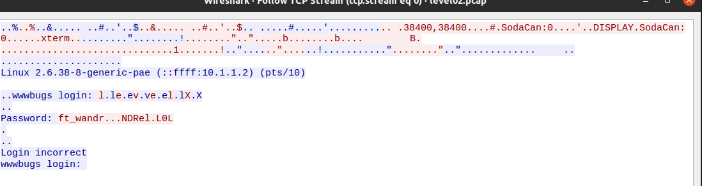
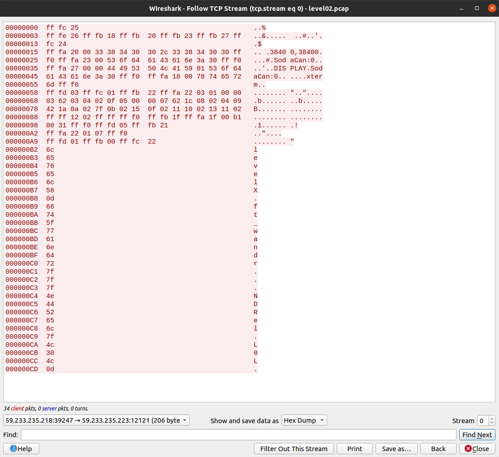

# level02

Alright, first thing we can see is the level02.pcap file.

We will need wireshark (Intra recommends to use cloudshark) to see the packets.

First, let's get the file on our machine.

```bash
➜  ressources git:(main) ✗ scp -P 4242 level02@localhost:~/level02.pcap .
       _____                      _____               _     
      / ____|                    / ____|             | |    
     | (___  _ __   _____      _| |     _ __ __ _ ___| |__  
      \___ \| '_ \ / _ \ \ /\ / / |    | '__/ _` / __| '_ \ 
      ____) | | | | (_) \ V  V /| |____| | | (_| \__ \ | | |
     |_____/|_| |_|\___/ \_/\_/  \_____|_|  \__,_|___/_| |_|
                                                        
  Good luck & Have fun

          10.0.2.15 
level02@localhost's password: f2av5il02puano7naaf6adaaf 
level02.pcap                                            100% 8302    16.5MB/s   00:00    
```

Now let's open it.

```bash
➜  ressources git:(main) ✗ chmod 644 level02.pcap 
➜  ressources git:(main) ✗ wireshark level02.pcap
```

Go to the analysis tab -> Follow TCP stream.

Ok, interesting, let's try it as flag, no success.



First, let's filter from client only and show it as hexdump.



```bash
000000B9  66                                                 f
000000BA  74                                                 t
000000BB  5f                                                 _
000000BC  77                                                 w
000000BD  61                                                 a
000000BE  6e                                                 n
000000BF  64                                                 d
000000C0  72                                                 r
000000C1  7f                                                 .
000000C2  7f                                                 .
000000C3  7f                                                 .
000000C4  4e                                                 N
000000C5  44                                                 D
000000C6  52                                                 R
000000C7  65                                                 e
000000C8  6c                                                 l
000000C9  7f                                                 .
000000CA  4c                                                 L
000000CB  30                                                 0
000000CC  4c                                                 L
000000CD  0d                                                 .
```

From the following output, we can see the 7f value which is 127.

This is too big to be a regular ascii character, lets refer to the ascii table. This is DEL.

If we extract the following inline stream.

`ft_wandr...NDRel.L0L.`

The last dot is 0d which is CR, the others are DEL.

`ft_waNDReL0L`

Let's try it as a flag.

```bash
level02@SnowCrash:~$ su flag02
Password: ft_waNDReL0L
Don't forget to launch getflag !
flag02@SnowCrash:~$ getflag
Check flag.Here is your token : kooda2puivaav1idi4f57q8iq
```

Cool ! Let's get to level03.

```bash
flag02@SnowCrash:~$ su level03
Password: kooda2puivaav1idi4f57q8iq
level03@SnowCrash:~$
```
